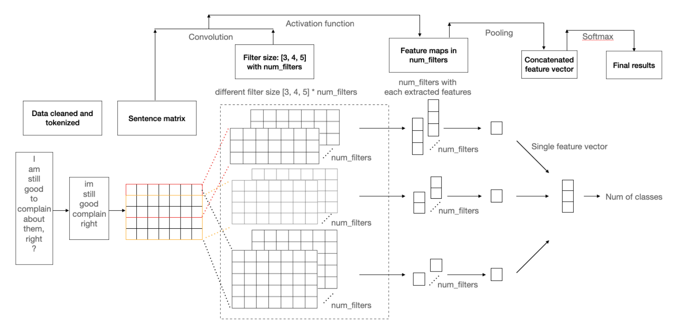

# NLP_pro

The Freedom Convoy was a truck driver protest that took place in Ottawa, the capital of Canada. More than 150,000 reviews have been posted on the Reddit Freedom Convoy thread. A sentiment analysis study on these reviews could help people understand the emotions and opinions towards this activity on the internet. To achieve this, This repository first utilized a pre-trained Tweet BERT model to classify the textual data into three classes: positive, negative, and neutral. Next,  performed feature engineering and trained CNN models on the provided dataset.

## Construction
The input text had been cleaned and embedded by the selected tokenizer, and it had been filtered by the set kernel, which was in different sizes. The activation function (relu) was then be applied, the future maps in the set num_filters were generated. The results were sent to the pooling layer and concatenated to a fused feature vector. The softmax had applied to the feature vector and lead to the final classification result. The model mainly relied on one convolutional layer for feature extraction; a pooling layer for reducing the length of the feature and concatenated to a single fusion vector. The more details were in blow:

## Comparison
As a mainstream NLP pre-training model, BERT can extract features from text data, namely word and sentence embedding vectors. Here, BERT and traditional Word2Vec word embedding methods had been compared for the performancn of vector embedded. 

BERT has an advantage over traditional models, such as Word2vec, that it can generate word representations that are dynamically informed by the words around the targets. For example, two sentences contain the same word, word2vec will generate the same word embedding for the word in both sentences, while BERT gives the word embedding that is different for each sentence since it is based on the context. 

In addition to capturing obvious differences (such as ambiguity), context-informed word embedding, BERT, is able to capture other forms of information that lead to more accurate feature representations and, in turn, better model performance. 

However, the experimental results are not the same as what guessed that the model applying Word2Vec for Word embedding obtained better results. This caught us attention and found out from the final word coverage. Because the data comes from the Internet, and the language of the Internet changes with each passing day. People use all kinds of new words and popular phrases, which are not covered in BERT. The results of 12785 words were found by BERT, and 24259 words were found by Word2vec. Using BERT model, about 2/3 of the input is replaced with an unknown token, so it is also reasonable to have poor performance in the final result.

## Differences
More details about the differences between the two embedded models
1. Input Format:
  - Word2Vec requires raw text input as a continuous string of words or preprocessed tokenized input. It treats each word as a separate entity and generates word embeddings based on its co-occurrence with other words in the text.
  - BERT, on the other hand, requires preprocessed input in the form of tokenized sentences or paragraphs. It generates contextualized embeddings, taking into account the surrounding words and their meaning in the sentence.
2. Embedding Quality:
  - Word2Vec generates static word embeddings that do not take into account the context in which the word appears. This can lead to suboptimal results when dealing with tasks that require contextual understanding, such as sentiment analysis or natural language inference.
  - BERT generates contextualized word embeddings that capture the meaning of a word based on its surrounding context. This makes it more effective than Word2Vec for a wide range of NLP tasks.
3. Training Data:
- Word2Vec requires a large corpus of text data for training. The quality of the embeddings depends heavily on the size and quality of the training data.
- BERT, on the other hand, is pre-trained on massive amounts of text data, such as the entire Wikipedia corpus, and can be fine-tuned on a smaller dataset for specific tasks.
- Training Time:
- Word2Vec is relatively faster to train compared to BERT, especially on smaller datasets.
- BERT requires a lot of computational resources and time to train due to its deep architecture and the massive amount of data used for pre-training.

Overall, BERT is more powerful than Word2Vec in most NLP tasks because of its contextualized word embeddings. However, if you have a small dataset or limited computational resources, Word2Vec may be a better option for generating embeddings.

## Note
Pay much attention on the match of the one-hot label and the predictions
predict == labels could lead to mathching errors when discuss accuracy  
>preds = torch.round(logits)  
>p = (preds - labels).cpu().numpy()  
>num = np.count_nonzero(p, axis = 1)  
>zero_num = num == 0  
>accuracy = zero_num.mean()

## Tag
Multi-class classification task

Sentiment analysis for reviews about Freedom_Convoy from reddit
